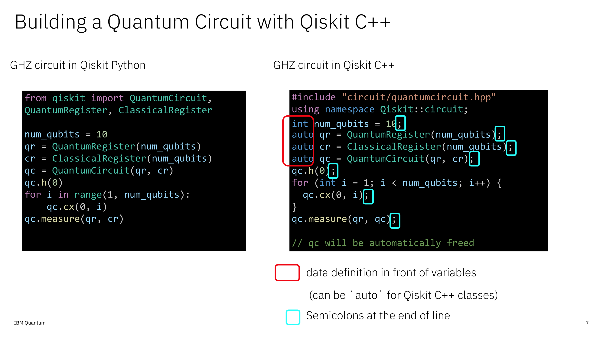
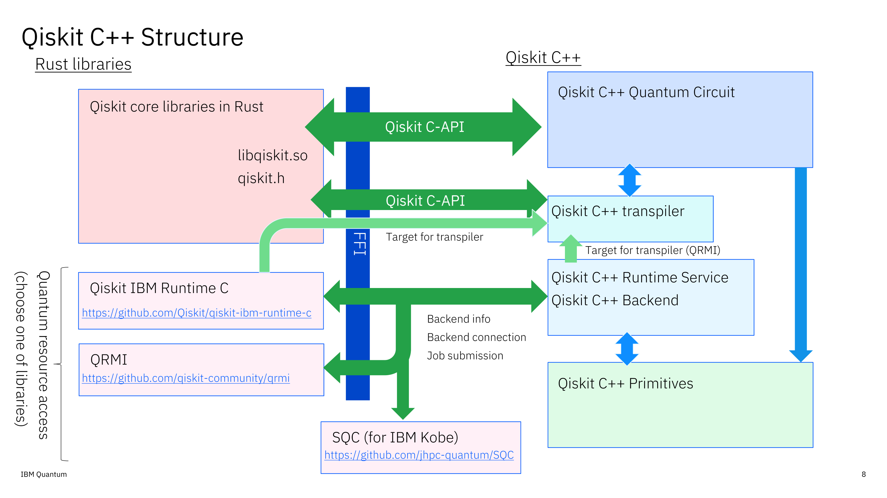

# Qiskit C++ Tutorial

## Qiskit C++ Overview
Qiskit C++ is an opensource interface library for Quantum Centric Super Computing applications.
Qiskit C++ provides similar interface classes to Python interface of Qiskit through Qiskit C-API, can be used from C++ applications.
You do not have to bind your applications to Python to make and run the quantum circuits.
Qiskit C++ is easy to use library, consists of header files only, so you do not have to build any binaries and install to the system, but you only have to include Qiskit C++ header files from your applicaitons.


Qiskit C++ supports:

- Building quantum circuits using standard gates
- Transpiling quantum circuits to ISA circuits for a target quantum hardware
- Running quantum circuits through sampler interface on a quantum hardware



This example shows building GHZ circuit in Qiskit (Python) and Qiksit C++.
As you can see, only the difference between Python and C++ is type definitions and end of line semicorons in C++.
Most of classes and functions implemented in Qiskit C++ are as same as that of Qiskit Python.
So it is easy to port Qiskit codes into your C++ applications using Qiskit C++.



This chart shows how Qiskit C++ is implemented by using Qiskit C-API. Qiskit C++ accesses Qiskit's core functions written in Rust through C-API.
To access quantum resources, we use one of `QRMI` https://github.com/qiskit-community/qrmi, `Qiskit IBM Runtime C` https://github.com/Qiskit/qiskit-ibm-runtime-c
 or `SQC` https://github.com/jhpc-quantum/SQC through runtime class of Qiskit C++.

## Getting started

Before coding with Qiskit C++, install dependencies.

### Bulding Qiskit C-API Library

```
git clone git@github.com:Qiskit/qiskit.git
cd qiskit
make c
```
To build Qiskit C-API library, you will need Rust compiler.
See also https://github.com/Qiskit/qiskit/tree/main/crates/cext

Make sure you will need the path to the Qiskit later to include and link from Qiskit C++.

### Building Runtime Service Interface Library

To access quantum hardware from Qiskit C++, install one of the runtime service API.
This example installs `QRMI` as a runtiem service API.

```
git clone git@github.com:qiskit-community/qrmi.git
cd qrmi
cargo build --release
```
Make sure you will need the path to the QRMI later to include and link from Qiskit C++.

### Other Software

Qiskit C++ uses nlohmann_json https://github.com/nlohmann/json to read/write JSON format.
Install and set include path so that Qiskit C++ can find it.

### Building Sample of Qiskit C++

Now you can use Qiskit C++ from the applications. This example builds examples of Qiskit C++.

```
cd samples
mkdir build
cd build
cmake -DQISKIT_ROOT=(put a path to the root of Qiskit you cloned) -DQRMI_ROOT=(put a path to the root of QRMI you cloned) ..
make
```
Set `QISKIT_ROOT` and `QRMI_ROOT` to cmake to set include path and library path referred from Qiskit C++.

In your applications, set include path and library path to compiler options:
```
-I${QISKIT_ROOT}/dist/c/include -I${QRMI}/
-L${QISKIT_ROOT}/dist/c/lib -L${QRMI}/target/Release
```

See [CMakeLists.txt](../samples/CMakeLists.txt) in samples.

## Getting Ready for Qiskit C++ Tutorial

Qiskit C++ tutorial uses Jupyter notebook to learn interactively. Before go into the tutorial, install Qiskit C-API and QRMI shown above, and install `xeus-cling` https://github.com/jupyter-xeus/xeus-cling to run C++ code interactively on Jupyter notebook.

***
## Tutorials

1. [Making Quantum Circuits](circuit.ipynb)
2. [Runnning Quantum Circuits](run_circuit.ipynb)


